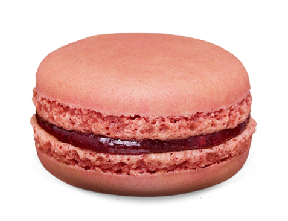

<div align="center">
    
</div>

# The French Ball

## Description
Welcome to **The French Ball** - my first ever software project! Crafted for educational purposes, this "Flappy Bird"-style game challenges players to **navigate a ball through French Macarons without making contact**.

For the sake of maintaining your peace of mind, it is recommended to not look at the code.

## How to Launch
- Ensure that the program is executed on Linux, Windows, or macOS. Running it within a Windows Subsystem for Linux (WSL) distribution is not recommended as it requires direct sound card access, which WSL does not natively support.
- Install pygame using pip
```bash
pip install pygame
```

### On Windows
```bash
python .\TheFrenchBall.py
```

### On Linux or macOS
```bash
python ./TheFrenchBall.py
```

## Authors
- Zach Kavungu
- Jordi Hoorelbeke
